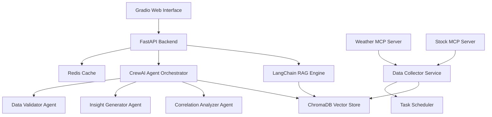

# Design Document

## Overview

The Weather-Stock Dashboard is a sophisticated data mashup application that leverages AI and modern data technologies to explore correlations between meteorological conditions and financial market performance. The system employs a microservices architecture with AI agents, vector databases, and retrieval-augmented generation to provide intelligent insights about weather-stock relationships.

The core innovation lies in using CrewAI agents to orchestrate complex analysis workflows, ChromaDB for semantic search across historical patterns, and LangChain for natural language interaction with the data. The system continuously ingests data from multiple sources via MCP servers and presents findings through an intuitive Gradio interface.

## Architecture

### High-Level Architecture



### Component Architecture

The system follows a layered architecture with clear separation of concerns:

1. **Presentation Layer**: Gradio-based web interface
2. **API Layer**: FastAPI REST endpoints
3. **Business Logic Layer**: CrewAI agents and LangChain RAG
4. **Data Layer**: ChromaDB vector store with Redis caching
5. **Integration Layer**: MCP servers for external data sources

## Components and Interfaces

### 1. Gradio Web Interface
- **Purpose**: User-facing dashboard for data exploration and query interaction
- **Key Features**: 
  - Interactive charts using Plotly for weather and stock visualizations
  - Natural language query input box
  - Real-time data refresh controls
  - Correlation insight display panels
- **Interface**: HTTP requests to FastAPI backend
- **Dependencies**: Gradio, Plotly, Pandas

### 2. FastAPI Backend Service
- **Purpose**: Central API orchestrator managing all system interactions
- **Endpoints**:
  - `GET /api/dashboard/current` - Current weather and stock data
  - `POST /api/query/natural` - Natural language query processing
  - `GET /api/insights/correlations` - AI-generated correlation insights
  - `GET /api/data/historical` - Historical data retrieval
  - `POST /api/timeseries/forecast` - ARIMA/GARCH time series forecasting
  - `GET /api/analysis/cross-correlation` - Cross-correlation analysis between weather and stock series
  - `POST /api/models/arima` - Fit ARIMA models to time series data
  - `POST /api/models/garch` - Fit GARCH models for volatility analysis
- **Interface**: REST API with JSON payloads
- **Dependencies**: FastAPI, Pydantic, asyncio, statsmodels, arch

### 3. LangChain RAG Engine
- **Purpose**: Natural language query processing and contextual data retrieval
- **Components**:
  - Query parser using LangChain's query transformation chains
  - ChromaDB retriever for semantic search
  - Response generator with context injection
- **Interface**: Python function calls from FastAPI
- **Dependencies**: LangChain, ChromaDB client, OpenAI/Anthropic API

### 4. CrewAI Agent Orchestrator
- **Purpose**: Coordinate multiple AI agents for complex analysis workflows
- **Agents**:
  - **Data Validator Agent**: Ensures data quality and consistency
  - **Correlation Analyzer Agent**: Performs statistical correlation analysis using ARIMA/GARCH models
  - **Time Series Forecaster Agent**: Implements ARIMA models for weather and stock price forecasting
  - **Volatility Analyzer Agent**: Uses GARCH models to analyze market volatility patterns relative to weather
  - **Insight Generator Agent**: Creates human-readable explanations of time series relationships
- **Interface**: CrewAI task execution framework
- **Dependencies**: CrewAI, scikit-learn, numpy, statsmodels, arch

### 5. ChromaDB Vector Store
- **Purpose**: Persistent storage for embeddings and metadata of weather-stock data
- **Collections**:
  - `weather_data`: Weather observations with temporal embeddings
  - `stock_data`: Stock prices with market context embeddings
  - `correlations`: Pre-computed correlation patterns
- **Interface**: ChromaDB Python client
- **Dependencies**: ChromaDB, sentence-transformers

### 6. MCP Server Integration
- **Purpose**: Standardized data collection from external APIs
- **Weather MCP Server**:
  - OpenWeatherMap API integration
  - NOAA weather data collection
  - Data normalization and validation
- **Stock MCP Server**:
  - Alpha Vantage API integration
  - Yahoo Finance data collection
  - Market hours awareness
- **Interface**: MCP protocol over HTTP/WebSocket
- **Dependencies**: MCP SDK, requests, asyncio

### 7. Data Collector Service
- **Purpose**: Orchestrate data ingestion from MCP servers into ChromaDB
- **Features**:
  - Scheduled data collection using APScheduler
  - Data transformation and embedding generation
  - Error handling and retry logic
- **Interface**: Internal service communication
- **Dependencies**: APScheduler, pandas, sentence-transformers

## Time Series Modeling Strategy

### ARIMA Models for Forecasting
The system employs AutoRegressive Integrated Moving Average (ARIMA) models to forecast both weather patterns and stock prices:

- **Weather ARIMA Models**: Capture seasonal patterns in temperature, precipitation, and other meteorological variables
- **Stock ARIMA Models**: Model price movements and trading volume patterns
- **Model Selection**: Automated ARIMA order selection using AIC/BIC criteria
- **Seasonal Decomposition**: Handle seasonal components in weather data using SARIMA extensions

### GARCH Models for Volatility Analysis
Generalized Autoregressive Conditional Heteroskedasticity (GARCH) models analyze volatility clustering in financial data:

- **Stock Volatility Modeling**: Capture time-varying volatility in stock returns
- **Weather Impact on Volatility**: Analyze how weather events affect market volatility
- **Model Variants**: Support for GARCH(1,1), EGARCH, and GJR-GARCH models
- **Volatility Forecasting**: Generate volatility forecasts with confidence intervals

### Cross-Correlation and Causality Analysis
Advanced statistical methods to identify weather-stock relationships:

- **Cross-Correlation Functions**: Identify optimal lag relationships between weather and stock series
- **Granger Causality Tests**: Determine if weather patterns can predict stock movements
- **Vector Autoregression (VAR)**: Model multivariate relationships between weather and stock variables
- **Impulse Response Functions**: Analyze how weather shocks propagate through stock markets

## Data Models

### Weather Data Model
```python
class WeatherData(BaseModel):
    timestamp: datetime
    location: str
    temperature: float
    humidity: float
    pressure: float
    precipitation: float
    wind_speed: float
    weather_condition: str
    embedding: List[float]  # Generated from weather description
```

### Stock Data Model
```python
class StockData(BaseModel):
    timestamp: datetime
    symbol: str
    price: float
    volume: int
    market_cap: Optional[float]
    sector: str
    change_percent: float
    embedding: List[float]  # Generated from market context
```

### Correlation Model
```python
class CorrelationInsight(BaseModel):
    id: str
    weather_pattern: str
    stock_pattern: str
    correlation_coefficient: float
    confidence_level: float
    time_period: str
    statistical_significance: float
    explanation: str
    supporting_data_points: int

class TimeSeriesAnalysis(BaseModel):
    id: str
    series_type: str  # 'weather' or 'stock'
    arima_order: Tuple[int, int, int]  # (p, d, q) parameters
    arima_forecast: List[float]
    arima_confidence_intervals: List[Tuple[float, float]]
    garch_volatility: Optional[List[float]]  # For stock data
    model_diagnostics: Dict[str, float]  # AIC, BIC, etc.
    forecast_horizon: int
    timestamp: datetime

class WeatherStockRelationship(BaseModel):
    id: str
    weather_series_id: str
    stock_series_id: str
    cross_correlation: List[float]  # Cross-correlation at different lags
    optimal_lag: int  # Lag with highest correlation
    granger_causality_p_value: float
    relationship_strength: str  # 'weak', 'moderate', 'strong'
    explanation: str
```

### Query Model
```python
class NaturalLanguageQuery(BaseModel):
    query_text: str
    user_id: Optional[str]
    timestamp: datetime
    processed_intent: Optional[str]
    retrieved_context: Optional[List[str]]
```

## Correctness Properties

*A property is a characteristic or behavior that should hold true across all valid executions of a system-essentially, a formal statement about what the system should do. Properties serve as the bridge between human-readable specifications and machine-verifiable correctness guarantees.*

### Property 1: Data Synchronization Consistency
*For any* weather data point and corresponding stock data point collected within the same time window, both data points should have timestamps within the specified collection intervals (1 hour for weather, 15 minutes for stocks during market hours)
**Validates: Requirements 1.2, 1.3**

### Property 2: Query Response Completeness
*For any* natural language query that matches existing data patterns in ChromaDB, the RAG_Engine should return relevant results with contextual explanations
**Validates: Requirements 2.1, 2.3**

### Property 3: Data Validation Round Trip
*For any* weather or stock data collected from external APIs, the data should pass validation rules and be successfully stored and retrieved from ChromaDB without corruption
**Validates: Requirements 6.1, 6.2**

### Property 4: Time Series Model Consistency
*For any* time series dataset with sufficient historical data points (minimum 50 observations), the ARIMA model should produce forecasts with confidence intervals and the GARCH model should generate volatility estimates for stock data
**Validates: Requirements 3.1, 3.2**

### Property 8: Cross-Correlation Analysis Validity
*For any* pair of weather and stock time series, the cross-correlation analysis should identify optimal lag relationships and provide Granger causality test results
**Validates: Requirements 3.1, 3.4**

### Property 5: Interface Responsiveness
*For any* user interaction with the Gradio interface, the system should respond within the specified time limits (2 seconds for interactions, 5 minutes for weather updates, 1 minute for stock updates)
**Validates: Requirements 4.2, 1.2, 1.3**

### Property 6: Error Handling Graceful Degradation
*For any* system component failure or data source unavailability, the Dashboard_System should continue operating with appropriate error messages and maintain system stability
**Validates: Requirements 1.5, 2.4, 6.4**

### Property 7: Data Storage Integrity
*For any* data collection cycle, all valid data points should be stored in ChromaDB with proper indexing and be retrievable through both vector similarity search and metadata filtering
**Validates: Requirements 5.3, 5.4**

## Error Handling

### API Integration Errors
- **Weather API Failures**: Implement exponential backoff retry logic with fallback to cached data
- **Stock API Rate Limits**: Queue requests and implement request throttling
- **MCP Server Disconnections**: Automatic reconnection with circuit breaker pattern

### Data Processing Errors
- **Invalid Data Formats**: Comprehensive validation with detailed error logging
- **Embedding Generation Failures**: Fallback to alternative embedding models
- **ChromaDB Connection Issues**: Local caching with eventual consistency

### User Interface Errors
- **Query Processing Failures**: Graceful degradation with suggested alternative queries
- **Visualization Rendering Issues**: Fallback to tabular data display
- **Real-time Update Failures**: Clear status indicators and manual refresh options

## Testing Strategy

### Unit Testing Approach
- **Component Isolation**: Test each service component independently using mocks for external dependencies
- **API Endpoint Testing**: Comprehensive testing of FastAPI endpoints with various input scenarios
- **Data Model Validation**: Test Pydantic models with edge cases and invalid data
- **Agent Behavior Testing**: Test individual CrewAI agents with controlled input scenarios
- **Time Series Model Testing**: Test ARIMA and GARCH model fitting with known synthetic datasets
- **Statistical Method Testing**: Validate cross-correlation and Granger causality implementations

### Property-Based Testing Approach
- **Framework**: Use Hypothesis for Python property-based testing with minimum 100 iterations per property
- **Data Generation**: Create smart generators for weather data (realistic temperature ranges, valid coordinates) and stock data (market hours, valid price movements)
- **Time Series Generation**: Generate synthetic time series with known ARIMA parameters to test model fitting accuracy
- **Correlation Testing**: Generate random datasets and verify correlation analysis produces consistent results
- **ARIMA/GARCH Testing**: Test model fitting with various parameter combinations and verify forecast accuracy
- **Query Testing**: Generate diverse natural language queries and verify RAG responses contain relevant context

### Integration Testing
- **End-to-End Workflows**: Test complete user journeys from query input to insight generation
- **MCP Server Integration**: Test data collection workflows with mock external APIs
- **ChromaDB Operations**: Test vector storage and retrieval with realistic data volumes

### Property-Based Test Requirements
- Each property-based test must run a minimum of 100 iterations
- Tests must be tagged with comments referencing design document properties using format: '**Feature: weather-stock-dashboard, Property {number}: {property_text}**'
- Each correctness property must be implemented by a single property-based test
- Use Hypothesis library for property-based testing implementation